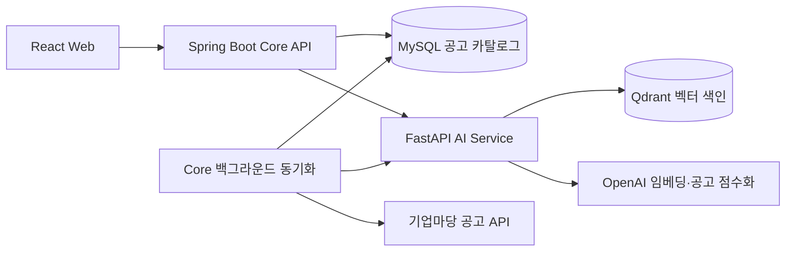

# 프로젝트 기술

[메인 README](../README.md) · [구현 현황](implementation-status.md) · [코드 아키텍처](architecture.md)

이 문서는 저장소의 코드와 설정을 기준으로 각 기술의 역할과 주요 구현 방식을 설명합니다.
기능의 완성 범위와 후속 과제는 [구현 현황](implementation-status.md)에서 관리합니다.

## 시스템 구성



사용자 요청의 진입점은 Core API입니다. 브라우저가 외부 공고 API나 AI Service를 직접 호출하지 않으며,
공공데이터포털 인증키와 OpenAI API 키는 서버에서 사용합니다. 공고 수집은 백그라운드에서 수행하고
사용자 검색은 이미 공개된 MySQL 카탈로그를 읽습니다.

## 기술 스택과 역할

버전은 저장소 설정 기준입니다. 범위로 선언한 패키지의 정확한 설치 버전은 각 lock 파일을 따릅니다.

| 영역 | 기술·설정 | 역할 | 기준 파일 |
|---|---|---|---|
| 웹 런타임 | Node.js 24.x, pnpm 11.22.x | 개발·빌드 환경 | [package.json](../frontend/package.json) |
| 화면 | React 19, TypeScript 6, React Router 8 | 채팅·상세 화면과 URL 라우팅 | [package.json](../frontend/package.json) |
| 웹 도구 | Vite 8, Tailwind CSS 4 | 개발 서버, 번들링, 스타일 | [package.json](../frontend/package.json) |
| 상태·연결 | Redux Toolkit 2, Awilix 13 | 대화 상태, UseCase·Repository 생성과 연결 | [app 구성](../frontend/src/app) |
| 웹 검증 | Zod 4, React Hook Form 7 | HTTP 응답과 예제 폼 검증 | [Frontend 안내](../frontend/README.md) |
| 공개 API | JDK 21, Kotlin 2.4.10, Spring Boot 4.1.0 | HTTP 계약, 업무 흐름, 외부 통신 | [build.gradle](../backend/core-api/build.gradle) |
| DB 접근 | MyBatis Spring Boot Starter 4.0.0, Flyway | XML SQL 실행과 스키마 버전 관리 | [build.gradle](../backend/core-api/build.gradle) |
| AI API | Python 3.11(Docker·CI), FastAPI 0.139.x, Pydantic 2 | 내부 API와 구조화된 요청·응답 검증 | [pyproject.toml](../backend/ai-service/pyproject.toml) |
| AI 호출 | OpenAI SDK 3.x, Agents SDK 0.22.x, tiktoken | 임베딩, 후보 점수화, 입력 토큰 제한 | [pyproject.toml](../backend/ai-service/pyproject.toml) |
| 공고 저장 | MySQL 8.4 | 현재 공고와 원본 식별자, 신청 기간 저장 | [Compose 설정](../infrastructure/compose.yaml) |
| 의미 검색 | Qdrant 1.17.1, qdrant-client 1.17.x | 임베딩 벡터 저장과 유사도 검색 | [Compose 설정](../infrastructure/compose.yaml) |
| 검증·실행 | Vitest, Testing Library, JUnit, Testcontainers, pytest, Docker Compose | 서비스별 테스트와 컨테이너 통합 검증 | [CI 정의](../.github/workflows/ci.yml) |

AI 패키지는 Python `>=3.11,<3.15`를 선언하며, Frontend와 AI Service의 의존성은 각각
`pnpm-lock.yaml`, `uv.lock`으로 관리합니다. 전체 환경변수는 서비스별 README에서 설명합니다.

## Frontend: 화면과 데이터 처리 분리

```text
View → ViewModel → UseCase → Repository → HTTP API
```

View는 입력과 화면 표시를 담당합니다. ViewModel은 검색 요청·취소·결과 반영 순서를 제어하고,
UseCase는 기능 실행 계약을, Repository는 API 응답을 화면에서 사용할 모델로 바꾸는 경계를 맡습니다.
Awilix의 앱 컨테이너가 이 객체들을 연결하며 ViewModel에서 필요한 UseCase를 조회합니다.

메시지·입력값·요청 상태는 Redux Toolkit에, 사이드바나 DOM 참조 같은 화면 전용 상태는 React Hook에
보관합니다. 현재 상태는 메모리에만 존재하므로 새로고침하면 대화가 초기화됩니다. 검색 요청에는 현재
검색 문장만 보내며 이전 메시지를 AI 대화 맥락으로 보내지 않습니다.

Zod가 HTTP 응답을 검증합니다. AbortController와 요청 ID는 화면 이탈·새 대화 이후 오래된 결과가
반영되는 것을 막습니다. 이 취소 처리가 서버의 OpenAI 작업 중단까지 보장하는 것은 아닙니다.
상태 관리 비교용 SampleItem은 별도 예제 화면이며 지원사업 기능과 분리되어 있습니다.

## Core API: 업무 흐름과 외부 경계

| 작업 | 기본 호출 방향 |
|---|---|
| 외부 API 호출 | Controller → Service → Facade → Client |
| MySQL 접근 | Controller → Service → Repository → MyBatis Mapper → Mapper XML → MySQL |
| 상태 계산·공고 모델 | 프레임워크와 무관한 Domain |

Facade는 외부 호출 결과의 검증과 내부 모델 변환을 감춥니다. 검색 Service는 공고 제공처의 HTTP
응답을 직접 다루지 않고 Repository와 검색·점수화 Facade를 조합합니다. DB 행 타입인 `DbRow`는
MyBatis 경계에서만 사용하며 공개 응답이나 Domain 모델로 노출하지 않습니다.

공개 DTO, 외부 DTO, 예외, 설정은 이를 소유하는 기능 가까이에 둡니다. 정확한 디렉터리와 명명 규칙은
[아키텍처](architecture.md), 실행·환경변수는 [Core API 안내](../backend/core-api/README.md)를 참고하세요.

## MySQL과 Qdrant의 역할

| 구분 | MySQL | Qdrant |
|---|---|---|
| 저장 대상 | 공고 제목·요약·신청 기간·출처·노출 상태 | 공고 검색 텍스트의 임베딩, ID·내용 해시 |
| 주요 용도 | 현재 검색 대상 결정, 상세 조회 | 검색 문장과 의미가 가까운 후보 선정 |
| 갱신 방식 | 제공처별 UPSERT와 누락 공고 비활성화 | 공고 ID·내용 해시별 벡터 생성·재사용 |
| 데이터 기준 | 현재 공개 카탈로그의 기준 | MySQL에서 재구성할 수 있는 검색 색인 |

MySQL의 `support_program`은 `(source_code, source_program_id)`를 고유키로 사용합니다.
분야·지역은 JSON 배열로, 신청 기간은 원문과 nullable 날짜로 저장합니다. `support_program_sync_generation`은
가장 최근에 시작된 동기화 세대를 기록합니다. 두 테이블은 [Flyway migration](../backend/core-api/src/main/resources/db/migration)으로 생성합니다.

접수 상태는 DB에 고정 저장하지 않고 조회 시 `Asia/Seoul`의 오늘 날짜로 계산합니다. 파싱된 날짜를
우선하고, 날짜만으로 결정하지 못한 경우 예정·종료·상시 등의 알려진 표현을 해석합니다. 종료 표현은
상시 표현보다 우선하며, 판정할 수 없으면 `UNKNOWN`입니다. 원문에 적힌 모든 예외 조건을 이해하는 판정기는 아닙니다.

검색 문서는 제목·기관·지원대상·분야·지역·신청기간·요약을 결합합니다. Core가 최대 12,000 코드 포인트로
제한한 텍스트의 SHA-256을 계산하고, AI Service는 임베딩 입력을 최대 8,191 토큰으로 제한합니다.
벡터 식별에는 `BIZINFO:원본ID`와 내용 해시를 함께 사용합니다. MySQL에 `content_hash` 컬럼은 있지만
현재 Repository는 이를 읽고 쓰지 않으며, 해시는 [검색 문서 Mapper](../backend/core-api/src/main/kotlin/ai/govbiz/core/supportprogram/client/ai/mapper/SupportProgramIndexDocumentMapper.kt)에서 계산합니다.

## 동기화와 색인 공개

```text
동기화 세대 발급 → 기업마당 전체 페이지 수집·검증 → 전체 공고 벡터 준비
    → 최신 시작 세대인지 확인 → MySQL 카탈로그를 하나의 트랜잭션으로 공개
```

기본 스케줄은 앱 시작 시 초기 지연 `PT0S`로 한 번, 이후 이전 실행이 끝난 시점부터 6시간 뒤입니다. 외부 수집과
색인은 DB 트랜잭션 밖에서 수행합니다. 모든 벡터가 준비된 뒤 현재 세대만 DB에 반영하므로,
색인 실패로 신규 공고의 검색 준비가 끝나지 않으면 기존 공개 카탈로그를 유지합니다.

DB 반영은 기존 `BIZINFO` 공고를 미노출 처리한 뒤 이번 목록을 UPSERT해 다시 노출하는 방식입니다.
이 두 작업은 한 트랜잭션이며 실패하면 함께 롤백됩니다. 늦게 끝난 이전 동기화는 세대 확인에서 공개를
건너뜁니다. 세대 관리는 중복 수집·색인 실행 자체를 막는 분산 잠금은 아닙니다.

별도 복구 스케줄러도 앱 시작 시 초기 지연 `PT0S`로 실행하고, 이후 완료 시점부터 1분마다 현재 MySQL 공고를 확인합니다.
동일한 벡터가 있으면 재사용하고 누락된 버전만 생성합니다. `SUPPORT_PROGRAM_INDEX_ENABLED=false`는
이 복구 스케줄러를 끄며, 기업마당 동기화 안의 공개 전 색인까지 끄지는 않습니다.

두 자동 경로는 `prune`을 호출하지 않습니다. 이전 내용·미노출 공고의 벡터는 현재 ID·해시 허용 목록에서
빠져 검색에 쓰이지 않지만 저장 공간은 남습니다. 안전한 삭제 수명주기는 후속 구현 범위입니다.

## 검색과 AI 점수화

1. MySQL에서 현재 노출된 기업마당 공고를 읽고 접수 상태 조건을 적용합니다.
2. 공고 ID·해시 허용 목록을 AI Service에 보내 Qdrant 검색 범위를 제한합니다.
3. OpenAI로 검색 문장을 임베딩하고 유사도 순으로 후보를 최대 20개 가져옵니다.
4. OpenAI Agents SDK의 단일 Agent가 후보 전체를 구조화된 응답으로 점수화합니다.
5. AI Service가 최소 점수·자격 조건을 적용하고 Core가 계약을 다시 검증해 최대 5개를 반환합니다.

대상 공고가 없으면 빈 목록을 반환합니다. 검색어가 비어 있으면 최신순 최대 5개를 반환하며,
두 경우 모두 AI Service를 호출하지 않습니다. 채팅 UI에서는 빈 검색어를 제출할 수 없습니다.

점수화의 실제 호출 방향은 `HTTP API → Service → Agent → OpenAI → Response`입니다.
벡터 검색은 별도 내부 API와 Qdrant를 사용하는 경로이며, 다중 Agent나 도구 탐색을 수행하지 않습니다.

| 점수 항목 | 최대 점수 |
|---|---:|
| 의미 관련성 | 40 |
| 지원대상 적합성 | 25 |
| 지역 적합성 | 15 |
| 접수 상태 적합성 | 10 |
| 지원 유형 적합성 | 10 |

`govbiz-support-program-ranking-v2`는 의미 관련성 20점 이상·총점 60점 이상을 요구합니다.
`targetEligibility` 또는 `regionEligibility`가 `INCOMPATIBLE`이면 제외하고, 정보가 부족한
`UNKNOWN`은 그 이유만으로 제외하지 않습니다. 이 값과 추천 점수는 신청 자격이나 선정 확률을 확정하지 않습니다.
상세한 필드와 오류 응답은 [검색 계약](support-program-search-contract.md)에 정리되어 있습니다.

저장소의 기본 설정은 점수화 `OPENAI_MODEL=gpt-5.6-luna`, 임베딩 `text-embedding-3-small`·1,536차원입니다.
설정은 [AI Service config](../backend/ai-service/app/config.py)와 [.env.example](../.env.example)을 기준으로 합니다.
키 누락은 AI Service 시작 오류이며, 검색 중 모델·벡터 장애는 오류 응답으로 반환합니다.

## 개발 환경과 검증

Docker Compose는 Vite 개발 서버, Core API, AI Service, MySQL, Qdrant를 함께 실행합니다.
AI Service는 기본 Compose에서 호스트 포트를 공개하지 않고 서비스 네트워크로 연결합니다.
이 구성에 운영 인증·배포 자동화가 포함되어 있다고 가정하면 안 됩니다.

[GitHub Actions](../.github/workflows/ci.yml)는 Frontend 테스트·lint·build, Core 빌드·MySQL 통합 테스트,
AI 테스트·패키지 빌드·평가 도구 테스트, 컨테이너 통합 검증을 정의합니다. Compose 검증은 실제
MySQL·Qdrant와 로컬 기업마당·OpenAI 스텁을 사용해 연결과 장애 복구를 확인합니다.
실제 공고 검색의 정확도는 별도의 실데이터 평가 대상입니다.
